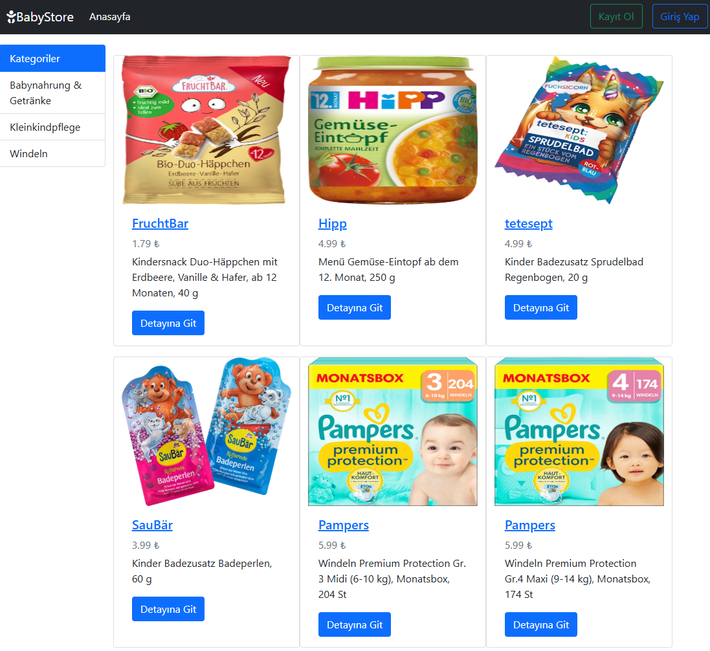

# Babyshop (Docker Example)

### Overview

This repository serves as an example of how to use a Dockerfile to build a Docker image and subsequently create a container to host a Django-based project.

The project demonstrates:

- Building a custom Docker image for a Django application.
- Running the application in a Docker container.
- Hosting the application on a specified port accessible via the host system.

### Quickstart

Prerequisites
To run this project, ensure you have the following installed on your system:

- Docker (latest version)

### Technologies

- Python 3.9
- Django 4.0.2
- Venv
- Pillow

### Instructions

1. Navigate to the application directory

```bash
  cd babyshop_app
```

2. Build the Docker Image

```bash
  docker build -t babyshop .
```

- `-t | tag` The -t option allows you to give the image an easily recognizable name and, optionally, a version (e.g., babyshop:1.0).
- `.`The dot (.) means the current directory is used as the build context

3. Create a Docker Container from the Image

```bash
  docker run -d -p 8025:5000 --name babyshop-app --restart always babyshop
```

- `-d | detached` Runs the container in the background
- `-p | port ` Maps the container's internal port (5000) to a port on the host system (8025).
- `--name ` Assigns a custom name to the container
- `--restart` Configures the container's restart policy

4. Log into the Container

```bash
  docker exec -it babyshop-app bash
```

- `exec` Allows you to run commands directly inside a container without restarting it.
- `-it | interactive & terminal` These options combined allow for an interactive shell session inside the container
- `babyshop-app` The name of the container where the command will be executed
- `bash` Starts the container's Bash shell, allowing you to work directly within the container

5. Create an Admin User

```bash
  python manage.py createsuperuser
```

```bash
  Username: admin
  E-Mail-Adresse: admin@example.com
  Passwort: *****
  Passwort (nochmals): *****
```

6. Open the Admin Dashboard [http://localhost:8025/admin](http://localhost:8025/admin)

7. Log in with the Admin User

8. Add Content to the Application

   - Categories
   - Items

---

## Preview

Below is a preview of the application running in the Docker container with content added:


